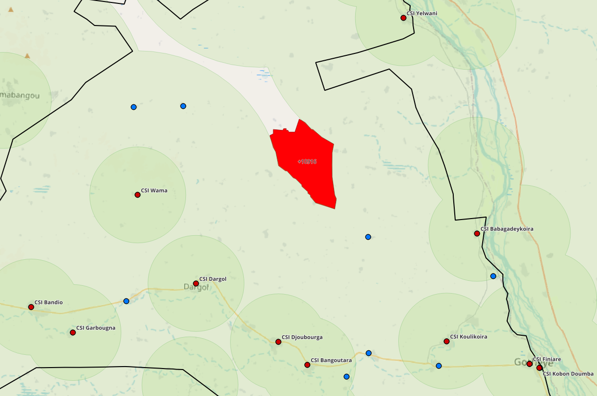
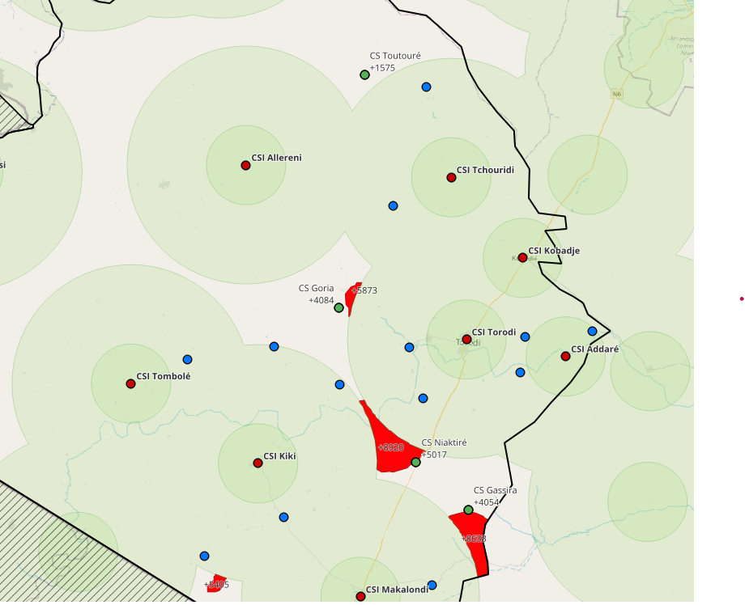

# Extension de la couverture sanitaire au Niger

Ce module permet d’automatiser le calcul d’un ensemble de métriques et d’analyses liées à l’extension de la couverture sanitaire au Niger. Il poursuit trois objectifs principaux :

* Identifier les zones où l’implantation d’un nouveau Centre de Santé Intégré (CSI) serait prioritaire
* Repérer les cases de santé pouvant être converties en CSI pour améliorer l’accès aux soins
* Mettre en évidence les CSI susceptibles d’être surchargés au regard de la population desservie

Les résultats de l'analyse sont consultables et téléchargeable depuis l'interface de la [carte sanitaire du Niger](https://www.cartesanitaireniger.org/#/reports).

## Principe

Le module combine plusieurs sources de données :
 - la distribution spatiale de la population,
 - la localisation des formations sanitaires existantes,
 - les limites administratives des districts sanitaires.

À partir de ces informations, il modélise :
 - les zones actuellement couvertes par les services de santé,
 - les populations insuffisamment desservies,
 - les priorités géographiques pour l’extension de la couverture sanitaire.

Les analyses sont réalisées à l’échelle de chaque district et des régions, afin de produire des résultats directement exploitables.

## Données d'entrée

Le module repose sur quatre sources de données :

### Population

Les données de distribution de la **population** sont nécessaires pour estimer les statistiques de couverture sanitaire. Le modèle utilise les données Worldpop pour l'année en cours (voir [worldpop.org](https://hub.worldpop.org/geodata/listing?id=135) pour plus d'information).

### Districts

Les districts sont l'unité d'aggregation principale du module d'analyse : l'ensemble des statistiques sont calculées de manière indépendente et isolée pour chaque district. Les résultats générés au niveau des régions utilisent les géométries aggrégées des districts fils. 

Le fichier de district est téléchargé automatiquement depuis une instance DHIS2. 

### Centres de santé

Les centres de santé sont les formations sanitaires correspondant à l'offre actuelle de couverture sanitaire.
C'est pourquoi cette catégorie de formations sanitaires peut inclure les hôpitaux en plus des centres de santé.

Le fichier est téléchargé automatiquement depuis une instance DHIS2.

### Cases de santé

Les cases de santé correspondent aux formations sanitaires candidates à une conversion en CSI.

Le fichier est téléchargé automatiquement depuis une instance DHIS2.

## Données de sortie

Le modèle calcule l'ensemble des métriques de manière indépendante pour chaque district : la population située de l’autre côté d’une frontière administrative n’est pas prise en compte dans l’estimation de la population desservie par un centre de santé.

  
*Image: Zone d'extension potentielle en rouge et population desservie*

Les zones d'extension potentielles sont des espaces caractérisés par une importante population mais une absence de CSI. Concrètement, une zone est identifiée comme prioritaire si la population desservie dépasse un seuil minimal (5 000 par défaut), et une distance au CSI le plus proche dépassant une certaine distance minimale (15 km par défaut).

  
*Image: Conversions possibles de cases de santé (en vert) et population desservie*

Les cases de santé susceptibles d’être converties en CSI sont identifiées selon deux critères : une population desservie importante (5 000 par défaut), et une distance minimale au CSI le plus proche (15 km par défaut).

## Paramètres de modélisation

* Distance minimale au CSI : la distance minimum requise à n'importe quel CSI existant pour qu'une zone ou case de santé puisse être considérée pour une extension (defaut = 15 000 m)
* Distance desservie : rayon autour duquel la population est considérée comme desservie (defaut = 5 000 m)
* Population desservie minimale : population minimale requise pour qu'une zone ou case de santé soit considérée pour une extension (defaut : 5 000 habitants)

## Visualisation et téléchargement des résultats

Les résultats de la modélisation peuvent être téléchargés depuis l'interface de la carte sanitaire du Niger, dans l'onglet [Atlas d'accessibilité](https://www.cartesanitaireniger.org/#/reports). Ils peuvent être filtrés par région et district, ainsi que par détail (soit seulement le fichier PDF, soit un dossier contenant tous les fichiers de sortie).

## Fichiers de sortie

* Résumé de l'analyse :
    * `xxx_carte_couverture_sanitaire.pdf`
    Fichier PDF regroupant les principaux résultats de l'analyse (population totale et desservie, carte, CS à potentielle conversion) et correspond à l'atlas s'il était généré via QGIS. 
* Résultats de l'analyse :
    * `extension_areas.gpkg`  
    Zones d'extension potentielles (géométries, population desservie, distance au CSI le plus proche).
    * `cs_extension_potential.gpkg`  
    CS à conversion potentielle (géométries, population desservie, distance au CSI le plus proche).
    * `population_coverage.gpkg`
    Pourcentages de population couverte à moins de 5, 10 et 15 km d'un CSI.
    * `helathcoverage_atlas.qgz`
    Projet QGIS contenant les éléments nécessaires à la production d’un atlas exportable en PDF. 
* Données intermédiaires et brutes :
    * `country.gpkg`
    Géométrie du pays.
    * `csi_population_served.gpkg`  
    Fichier CSI enrichi avec la population desservie.
    * `cs_population_served.gpkg`  
    Fichier Cases de Santé enrichi avec la population desservie.
    * `priority_areas.gpkg`  
    Raster avec population desservie pour chaque pixel de 100 m.
    * dossier `buffer_areas`  
    Contient des couches géospatiales intermédiaires utilisées pour la génération de l’atlas